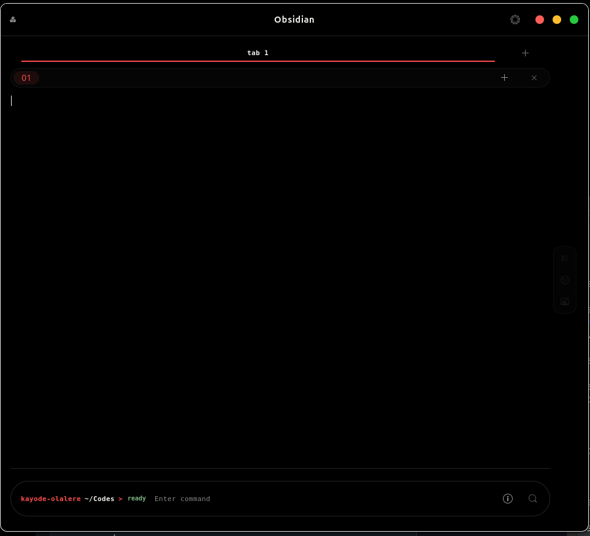
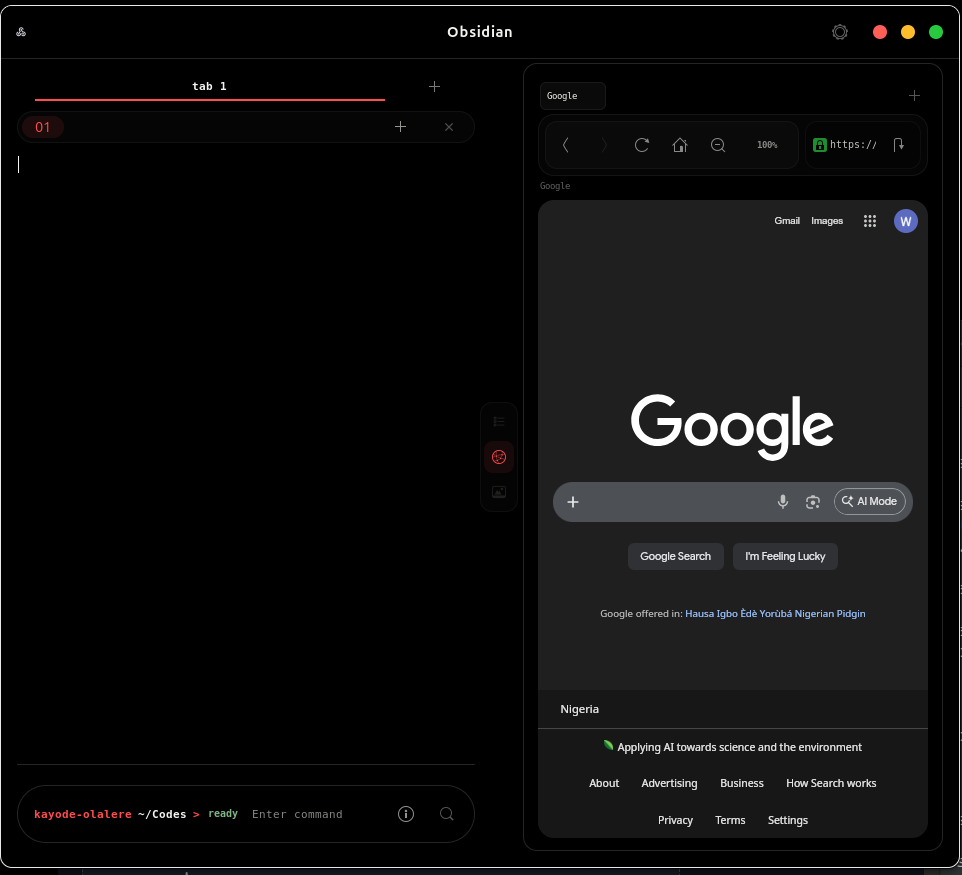
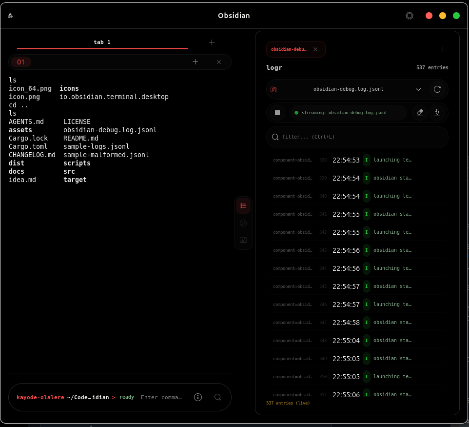
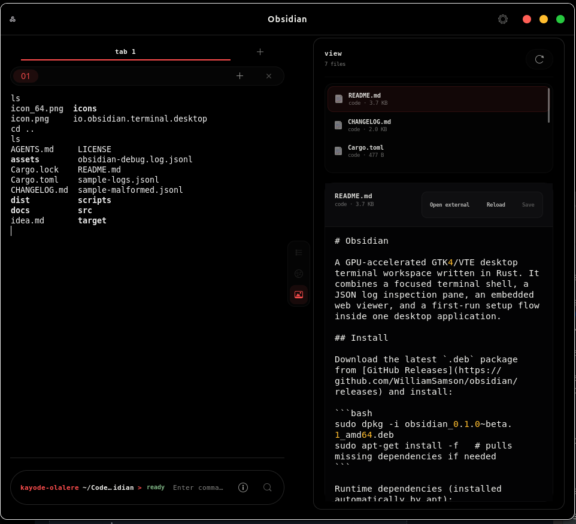
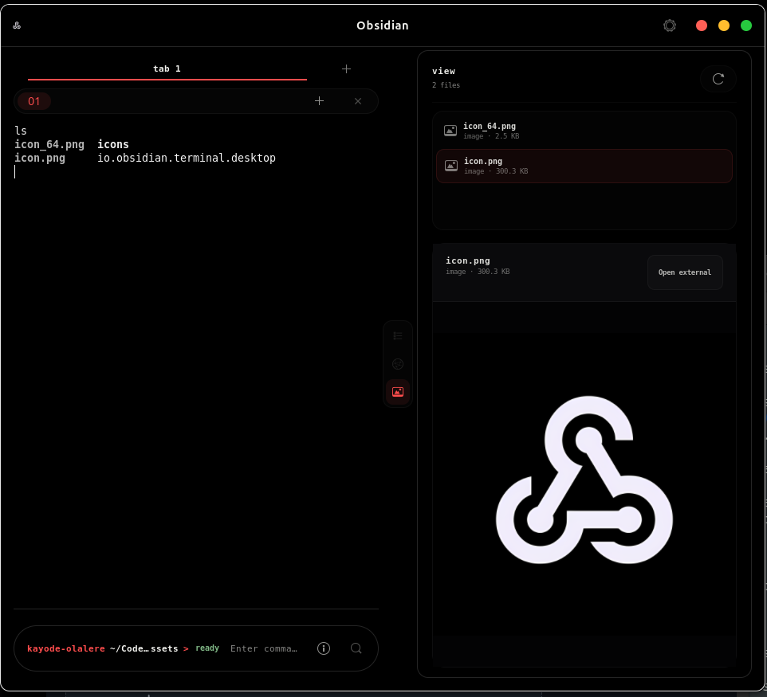
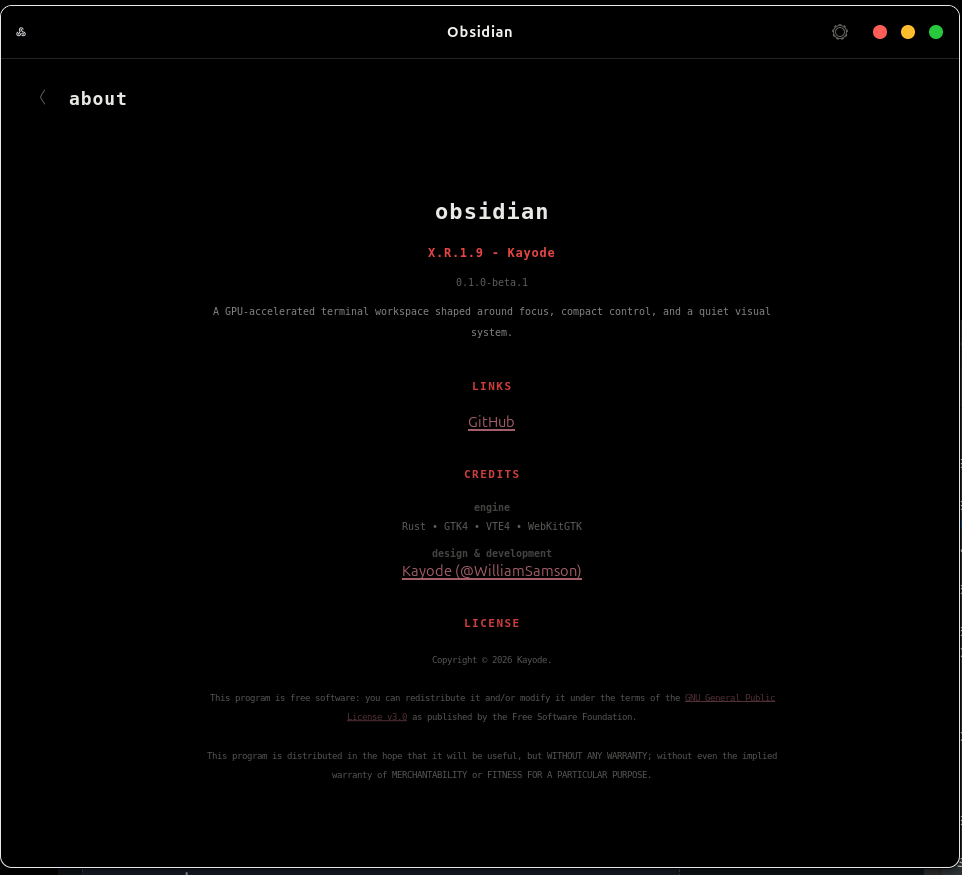

# Obsidian

Obsidian is for developers who live in the terminal and hate switching windows to tail logs, check docs, or do a quick search. It puts your shell, a live JSON log viewer, and a web pane side by side in one workspace — so you stop context-switching and start shipping.

A GPU-accelerated GTK4/VTE terminal built in Rust for Linux. Designed for backend and DevOps workflows where `kubectl logs`, application traces, and a browser are always one pane away.

## Screenshots













## Install

Download the latest `.deb` package from [GitHub Releases](https://github.com/WilliamSamson/obsidian/releases) and install:

```bash
sudo dpkg -i obsidian_0.1.0~beta.1_amd64.deb
sudo apt-get install -f   # pulls missing dependencies if needed
```

Runtime dependencies (installed automatically by apt):
- `libgtk-4-1`
- `libvte-2.91-gtk4-0`
- `libwebkitgtk-6.0-4`

Uninstall:

```bash
sudo apt remove obsidian
```

## Features

- Custom desktop chrome with macOS-style window controls
- First-run setup wizard with checkpoint restore
- Autosaving settings with separate terminal and app font sizes
- Desktop notification toggle for command completion
- Terminal tabs with rename, reorder, quick switcher, and split panes
- Pane-local terminal multiplexer sessions with keyboard cycling
- Terminal enhancements:
  - clipboard integration and command history
  - in-app command completion notices
  - terminal inspector
  - sixel image rendering toggle
  - ligature shaping toggle
- Side panes:
  - `logr` JSON log viewer with live follow, filtering, and export
  - embedded web pane with selectable default search engine
- Workspace restore for tabs, split position, and active pane
- File-based log viewing with piped stdin support
- Startup filters via `--filter` arguments
- Graceful rendering of malformed JSON lines

See [docs/FEATURES.md](docs/FEATURES.md) for a fuller feature inventory.
See [docs/TERMINAL_WORKSPACE_GUIDE.md](docs/TERMINAL_WORKSPACE_GUIDE.md) for the full desktop terminal usage guide.

## Build from Source

Requirements:

- Rust toolchain
- GTK4, VTE4, and WebKitGTK 6.0 development libraries

Install build dependencies (Ubuntu 24.04+):

```bash
./scripts/install-ubuntu-deps.sh
```

Build and run:

```bash
cargo build --release
./target/release/obsidian
```

Build the `.deb` package:

```bash
./scripts/build-release.sh
```

## Usage

Launch the terminal workspace:

```bash
obsidian
```

Open the log viewer against a file:

```bash
obsidian sample-logs.jsonl
```

Pipe logs from another command:

```bash
kubectl logs mypod -f | obsidian
```

Start with filters:

```bash
obsidian --filter level=error --filter query=request sample-logs.jsonl
```

Supported filter keys: `level=trace|debug|info|warn|error`, `query=<text>`, `search=<text>`

## Log Workspace Controls

| Key | Action |
|-----|--------|
| `Up/Down`, `j/k`, `PgUp/PgDn`, `Home/End` | Navigate |
| Mouse wheel | Scroll |
| `/` | Enter search mode |
| `Enter` or `Esc` | Exit search mode |
| `t`, `d`, `i`, `w`, `e` | Toggle level filters |
| `c` | Clear query and level filters |
| `x` | Export filtered view |
| `?` | Toggle help |
| `q` | Quit |

## Repository Layout

```
src/
  app.rs                    Ratatui application shell
  features/logs/            Log ingestion, filters, and viewer
  linux_terminal/           GTK/VTE terminal workspace
  renderer/                 Custom window renderer
  ui/                       Shared layout and theme
scripts/
  build-deb.sh              Build .deb package
  build-release.sh          Build release artifact
  install.sh                Per-user installer (non-deb)
  uninstall.sh              Per-user uninstaller
  install-ubuntu-deps.sh    Install build dependencies
docs/
  FEATURES.md               Product feature list
  LINUX_BUNDLE_PACK.md      AppDir/AppImage packaging guide
```

## Fixtures

- `sample-logs.jsonl`: clean baseline fixture
- `sample-malformed.jsonl`: malformed-line fixture for error rendering

## License

This project is licensed under the [GNU General Public License v3.0](LICENSE).
